# AWS DevSecOps Demo

DevSecOps platform built with AWS-native services. Terraform provisions everything: VPC, EKS on Fargate, CodePipeline with security gates, Cognito auth, and compliance evidence collection.

## What You Get

- **Automated CI/CD**: CodePipeline with security scanning (secrets, SAST, SBOM, CVEs)
- **Secure Runtime**: EKS on Fargate with Cognito authentication via ALB
- **Full Observability**: CloudWatch alarms, SNS notifications, compliance evidence in S3
- **Security by Default**: Least-privilege IAM, Amazon Inspector, OPA policy enforcement

## Architecture

```text
Developer → CodeCommit → CodePipeline → CodeBuild → ECR + EKS + S3
                                             ↓
                                    Security Gates (SBOM, SAST, Secrets)

End User → ALB → Cognito Auth → EKS Fargate → Spring Boot App
```

**Key Components:** VPC (2 AZs) • EKS Fargate • CodePipeline/CodeBuild • ALB + Cognito • ECR + Inspector • S3 compliance • Optional WAF

## AWS Resources

This demo creates the following AWS resources:

| Service | Resource | Purpose |
|---------|----------|---------|
| **Networking** | | |
| VPC | Custom VPC (10.20.0.0/16) | Isolated network for all resources |
| Subnets | 2 public + 2 private (across 2 AZs) | High availability and fault tolerance |
| NAT Gateways | 2 (one per AZ) | Outbound internet access for private subnets |
| Internet Gateway | 1 | Inbound/outbound internet for public subnets |
| Route Tables | Public + Private | Traffic routing configuration |
| **Compute** | | |
| EKS Cluster | Control plane (v1.34) | Managed Kubernetes orchestration |
| Fargate Profiles | kube-system + demo namespace | Serverless container execution (no EC2 instances) |
| **Load Balancing** | | |
| Application Load Balancer | Internet-facing ALB | HTTPS traffic distribution + Cognito integration |
| Target Groups | IP-based targeting | Routes traffic to Fargate pod IPs |
| AWS Load Balancer Controller | Kubernetes controller | Manages ALB from K8s manifests |
| **CI/CD Pipeline** | | |
| CodeCommit | Git repository | Source code version control |
| CodePipeline | 3-stage pipeline | Orchestrates Source → Build → Deploy |
| CodeBuild | Build project | Runs security scans, tests, builds Docker images |
| **Container Registry** | | |
| ECR Repository | Private Docker registry | Stores container images |
| Amazon Inspector | Image scanning | CVE detection in container images |
| **Security & Auth** | | |
| Cognito User Pool | User directory | Authentication for application access |
| Cognito App Client | OAuth 2.0 client | ALB integration for auth flow |
| Secrets Manager | Encrypted secrets | Stores Cognito client secret |
| WAF Web ACL (optional) | Firewall rules | Protects against SQLi, XSS, rate limiting |
| **Storage** | | |
| S3 Bucket (compliance) | Versioned bucket | Stores SBOM, security scan reports, test results |
| S3 Bucket (terraform state) | Versioned + encrypted | Terraform remote state backend |
| **Database** | | |
| DynamoDB Table | terraform-state-lock | State locking for concurrent Terraform runs |
| **Monitoring** | | |
| CloudWatch Alarms | 5 alarms | Monitor ALB errors, unhealthy targets, pipeline failures |
| CloudWatch Logs | Log groups | EKS control plane and application logs |
| SNS Topic | Email notifications | Alert delivery for alarm triggers |
| **IAM** | | |
| IAM Roles | 6 roles | Least-privilege access for EKS, CodeBuild, ALB controller |
| IAM Policies | Custom policies | Fine-grained permissions for each service |
| OIDC Provider | EKS OIDC endpoint | Enables IAM roles for service accounts (IRSA) |

**Total Resources:** ~40-45 AWS resources across 15+ services

**Why Fargate?** No EC2 instances to manage, patch, or secure. Pay only for pod CPU/memory usage. Built-in isolation and security.

## Repository Structure

```text
aws-devsecops-demo/
├── app-cicd/                   # Spring Boot application with CI/CD config
│   ├── src/
│   │   ├── main/java/          # Application code
│   │   └── test/java/          # Unit tests
│   ├── k8s/                    # Kubernetes manifests
│   │   ├── deployment.yaml
│   │   ├── service.yaml
│   │   ├── targetgroupbinding.yaml
│   │   ├── hpa.yaml
│   │   ├── pdb.yaml
│   │   └── namespace.yaml
│   ├── policies/               # OPA policies for K8s validation
│   │   └── k8s.rego
│   ├── performance-tests/
│   │   └── load-test.jmx
│   ├── buildspec.yml           # CodeBuild pipeline definition
│   ├── Dockerfile
│   ├── pom.xml
│   ├── checkstyle.xml
│   └── test-local.sh
├── platform-terraform/         # Main infrastructure code
│   ├── eks.tf                  # EKS cluster configuration
│   ├── networking.tf           # VPC, subnets, NAT gateways
│   ├── pipeline.tf             # CodePipeline, CodeBuild, CodeCommit
│   ├── alb_cognito.tf          # ALB + Cognito authentication
│   ├── s3_ecr.tf               # S3 buckets, ECR repository
│   ├── cloudwatch.tf           # Alarms and monitoring
│   ├── iam.tf                  # IAM roles and policies
│   ├── secrets.tf              # Secrets Manager
│   ├── sns.tf                  # SNS for notifications
│   ├── waf.tf                  # WAF (optional)
│   ├── backend.tf              # Terraform state backend config
│   ├── main.tf
│   ├── variables.tf
│   ├── outputs.tf
│   └── versions.tf
├── terraform-backend/          # Terraform state backend setup
│   ├── main.tf
│   ├── variables.tf
│   └── outputs.tf
├── images/                     # Deployment screenshots
└── README.md
```

**Note:** The buildspec is embedded in Terraform (platform-terraform/pipeline.tf), not read from CodeCommit. Modifying buildspec.yml requires running terraform apply.

## Cost Warning

This demo uses real AWS infrastructure. If you leave it running, expect **~$186-211/month** in charges:

- EKS control plane: ~$73/month
- Fargate pods (2 replicas): ~$18/month
- NAT Gateways (2 AZs): ~$66/month
- ALB: ~$18-24/month
- Everything else: ~$11-16/month

Run `terraform destroy` when you're done to delete everything (~15-20 min). See the [Teardown](#teardown) section.

## Quick Start

### Prerequisites

- AWS CLI v2 + admin credentials configured (`aws configure`)
- Terraform ≥ 1.9 (latest: [1.14.x](https://github.com/hashicorp/terraform/releases))
- kubectl 1.34.x, eksctl, helm 3+
- Java 21, Maven 3.9+ (for local testing only)
- Git configured for CodeCommit (will be set up in steps below)

**Note:** kubectl version should match your EKS version (1.34) for compatibility.

### Getting Started

**First, clone this repository:**

```bash
# Clone the repository
git clone <your-repo-url> aws-devsecops-demo
cd aws-devsecops-demo

# You are now in the project root directory
pwd
# Should show: /path/to/aws-devsecops-demo
```

All subsequent commands assume you start from this project root directory unless explicitly stated otherwise.

### Pre-Flight Security Check

Before deployment, verify no sensitive data is in your repository:

```bash
# Check for accidentally committed secrets (should return nothing)
grep -r "AKIA\|secret\|password" . --exclude-dir=.git --exclude-dir=target 2>/dev/null | \
  grep -v "# " | grep -v "detect-secrets" | grep -v "aws_secretsmanager" | grep -v "client_secret"

# Verify AWS account
aws sts get-caller-identity

# Confirm you're in the right region
aws configure get region  # Should be us-east-1 or your target region
```

**Important:** All sensitive files are already in `.gitignore` (`outputs.txt`, `*.tfstate`, `devsecops-repo/`, credentials, etc.). Never commit sensitive data!

### 1. Test Locally (Optional)

**From project root:**

```bash
# Should be in: aws-devsecops-demo/ (project root)
cd app-cicd

# Should now be in: app-cicd/
./test-local.sh --quick        # Runs tests + security scans locally
# OR
mvn spring-boot:run            # http://localhost:8080

# Return to project root
cd ..
# Should now be in: aws-devsecops-demo/ (project root)
```

### 2. Setup Terraform Backend (One-Time)

**Option A: Using Terraform (Recommended)**

**From project root:**

```bash
# Should be in: aws-devsecops-demo/ (project root)
cd terraform-backend

# Should now be in: terraform-backend/
terraform init
terraform apply

# Get bucket name for next step
BUCKET=$(terraform output -raw s3_bucket_name)

# Update platform-terraform backend config
cd ../platform-terraform

# Should now be in: platform-terraform/
sed -i.bak "s/YOUR-TERRAFORM-STATE-BUCKET-NAME/${BUCKET}/" backend.tf

# Initialize with remote backend
terraform init
# Stay in platform-terraform/ directory for next step
```

**Option B: Manual Setup (Alternative)**

**From project root:**

```bash
# Should be in: aws-devsecops-demo/ (project root)
cd platform-terraform

# Should now be in: platform-terraform/

# Create secure state backend
ACCOUNT_ID=$(aws sts get-caller-identity --query Account --output text)
BUCKET="terraform-state-${ACCOUNT_ID}"

aws s3 mb s3://${BUCKET} --region us-east-1
aws s3api put-bucket-versioning --bucket ${BUCKET} --versioning-configuration Status=Enabled
aws s3api put-bucket-encryption --bucket ${BUCKET} \
  --server-side-encryption-configuration '{"Rules":[{"ApplyServerSideEncryptionByDefault":{"SSEAlgorithm":"AES256"},"BucketKeyEnabled":true}]}'
aws s3api put-public-access-block --bucket ${BUCKET} \
  --public-access-block-configuration "BlockPublicAcls=true,IgnorePublicAcls=true,BlockPublicPolicy=true,RestrictPublicBuckets=true"

aws dynamodb create-table --table-name terraform-state-lock \
  --attribute-definitions AttributeName=LockID,AttributeType=S \
  --key-schema AttributeName=LockID,KeyType=HASH \
  --billing-mode PAY_PER_REQUEST --region us-east-1
aws dynamodb wait table-exists --table-name terraform-state-lock

# Update backend.tf with bucket name
sed -i.bak "s/YOUR-TERRAFORM-STATE-BUCKET-NAME/${BUCKET}/" backend.tf

terraform init
```

### 3. Deploy Infrastructure

**From the `platform-terraform/` directory:**

```bash
# Should be in: platform-terraform/
terraform apply -var project=devsecops -var environment=demo
# Takes ~15-20 minutes (EKS cluster creation)

# Capture outputs
terraform output > ../outputs.txt
```

**Verify Infrastructure:**

**Still in `platform-terraform/` directory:**

```bash
# Should be in: platform-terraform/
export CLUSTER_NAME=$(terraform output -raw eks_cluster_name)
export ACCOUNT_ID=$(aws sts get-caller-identity --query Account --output text)

# Update kubeconfig
aws eks update-kubeconfig --name $CLUSTER_NAME --region us-east-1

# Grant your IAM user cluster access (required for kubectl)
aws eks create-access-entry --cluster-name $CLUSTER_NAME \
  --principal-arn arn:aws:iam::${ACCOUNT_ID}:user/$(aws sts get-caller-identity --query 'Arn' --output text | cut -d'/' -f2) \
  --type STANDARD --region us-east-1 2>/dev/null || echo "Access entry already exists"

aws eks associate-access-policy --cluster-name $CLUSTER_NAME \
  --principal-arn arn:aws:iam::${ACCOUNT_ID}:user/$(aws sts get-caller-identity --query 'Arn' --output text | cut -d'/' -f2) \
  --policy-arn arn:aws:eks::aws:cluster-access-policy/AmazonEKSClusterAdminPolicy \
  --access-scope type=cluster --region us-east-1 2>/dev/null || echo "Policy already associated"

# Verify cluster is ready (should show ACTIVE)
aws eks describe-cluster --name $CLUSTER_NAME --query 'cluster.status'

# Check Fargate profiles exist (you need both kube-system and demo)
aws eks list-fargate-profiles --cluster-name $CLUSTER_NAME

# Check CoreDNS addon - this is critical!
aws eks describe-addon --cluster-name $CLUSTER_NAME --addon-name coredns --query 'addon.status'

# Note: CoreDNS can take 2-3 minutes to become ACTIVE after cluster creation.
# If it shows DEGRADED, wait a bit before troubleshooting. See troubleshooting section if it stays degraded.
```

**Optional features:**

```bash
# Email notifications
terraform apply -var alert_email=ops@example.com

# WAF with rate limiting
terraform apply -var enable_waf=true -var blocked_countries='["CN","RU"]'

# Custom ACM certificate
terraform apply -var acm_certificate_arn=arn:aws:acm:region:account:certificate/id
```

### 4. Install AWS Load Balancer Controller

**Still in `platform-terraform/` directory:**

```bash
# Should be in: platform-terraform/
export CLUSTER_NAME=$(terraform output -raw eks_cluster_name)
export ACCOUNT_ID=$(aws sts get-caller-identity --query Account --output text)

aws eks update-kubeconfig --name $CLUSTER_NAME --region us-east-1

eksctl utils associate-iam-oidc-provider --cluster=$CLUSTER_NAME --approve

curl -o iam-policy.json https://raw.githubusercontent.com/kubernetes-sigs/aws-load-balancer-controller/v2.14.1/docs/install/iam_policy.json
aws iam create-policy --policy-name AWSLoadBalancerControllerIAMPolicy --policy-document file://iam-policy.json

eksctl create iamserviceaccount \
  --cluster=$CLUSTER_NAME --namespace=kube-system \
  --name=aws-load-balancer-controller \
  --attach-policy-arn=arn:aws:iam::${ACCOUNT_ID}:policy/AWSLoadBalancerControllerIAMPolicy \
  --approve

helm repo add eks https://aws.github.io/eks-charts && helm repo update

# Get VPC ID for Fargate (required - Fargate doesn't have EC2 metadata)
export VPC_ID=$(aws eks describe-cluster --name $CLUSTER_NAME --region us-east-1 --query 'cluster.resourcesVpcConfig.vpcId' --output text)

helm install aws-load-balancer-controller eks/aws-load-balancer-controller \
  -n kube-system --set clusterName=$CLUSTER_NAME \
  --set serviceAccount.create=false --set serviceAccount.name=aws-load-balancer-controller \
  --set vpcId=$VPC_ID

# Confirm controller is running (may take 1-2 minutes, should show 2/2 ready)
kubectl get deployment -n kube-system aws-load-balancer-controller
```

### 5. Deploy Application

**Still in `platform-terraform/` directory, then move to project root:**

```bash
# Should be in: platform-terraform/
# Move to project root first
cd ..

# Should now be in: aws-devsecops-demo/ (project root)
# Clone CodeCommit repo
git clone $(cd platform-terraform && terraform output -raw codecommit_clone_url) devsecops-repo
cd devsecops-repo

# Should now be in: aws-devsecops-demo/devsecops-repo/
# Copy application code (including hidden files)
cp -r ../app-cicd/* .
cp ../app-cicd/.dockerignore .  # Speeds up Docker builds

# Commit and push (pipeline triggers automatically)
git add .
git commit -m "Initial deployment - DevSecOps Demo Platform

- Spring Boot 3.3.4 with Java 21 (LTS)
- Complete CI/CD buildspec with security gates
- Kubernetes manifests with security best practices
- 12 OPA policies enforced
- EKS 1.34 with Fargate"

git push origin main

# Go back to project root
cd ..
# Should now be in: aws-devsecops-demo/ (project root)
```

> **📝 Important Note:** The CodeBuild project uses the buildspec from `app-cicd/buildspec.yml` (embedded in Terraform via `file()` function), **NOT** from the buildspec.yml in CodeCommit. This means:
>
> - Changes to `app-cicd/buildspec.yml` require `terraform apply` to take effect
> - Changes to `devsecops-repo/buildspec.yml` (in CodeCommit) have no effect on the pipeline
> - This design ensures the buildspec is version-controlled with your infrastructure code
>
> See [platform-terraform/pipeline.tf](platform-terraform/pipeline.tf) line 76: `buildspec = file("${path.root}/../app-cicd/buildspec.yml")`

**Monitor Pipeline:**

**From `platform-terraform/` directory:**

```bash
# Should be in: aws-devsecops-demo/ (project root)
cd platform-terraform

# Should now be in: platform-terraform/
# Get pipeline name
PIPELINE_NAME=$(terraform output -raw codepipeline_name)

# Watch pipeline progress (press Ctrl+C to exit when done)
watch -n 10 "aws codepipeline get-pipeline-state --name $PIPELINE_NAME --query 'stageStates[*].[stageName,latestExecution.status]' --output table"

# Or just open the AWS Console - easier to watch:
echo "Pipeline URL: https://console.aws.amazon.com/codesuite/codepipeline/pipelines/$PIPELINE_NAME/view"
```

**Pipeline stages** (usually 8-12 min, but first run can take 15):

1. Source: Pulls from CodeCommit
2. BuildDeploy: Runs security scans, builds Docker image, deploys to EKS

**Build process checks:**

- ✓ Secret scanning passed
- ✓ Checkstyle passed
- ✓ SpotBugs passed
- ✓ Dependency-Check skipped (enable via RUN_DEPENDENCY_CHECK=true)
- ✓ Unit tests passed
- ✓ Code coverage ≥70%
- ✓ Docker image built and pushed to ECR
- ✓ SBOM generated
- ✓ Conftest policy checks passed (12 OPA policies)
- ✓ kubectl apply succeeded
- ✓ Deployment rollout completed

**Verify Deployment:**

```bash
# Quick health check - are your pods running?
kubectl get pods -n demo  # Should see 2 pods in Running state
kubectl get deployment -n demo  # Should show 2/2 ready

# Check TargetGroupBinding (gives it a minute to create after controller starts)
kubectl get targetgroupbinding -n demo

# View app logs to confirm Spring Boot started
kubectl logs -n demo -l app.kubernetes.io/name=devsecops-demo --tail=50

# Verify ALB can reach your pods
TARGET_GROUP_ARN=$(terraform output -raw alb_target_group_arn)
aws elbv2 describe-target-health --target-group-arn $TARGET_GROUP_ARN
# Should show 2 healthy targets with Fargate pod IPs
```

### 6. Access Application

```bash
# Create a test user (for demo - in production you'd use your identity provider)
USER_POOL_ID=$(terraform output -raw cognito_user_pool_id)

# Create a test user (use a strong password - this is just an example)
aws cognito-idp admin-create-user \
  --user-pool-id $USER_POOL_ID --username testuser \
  --user-attributes Name=email,Value=test@example.com \
  --temporary-password "TempP@ss$(date +%s)" --message-action SUPPRESS

# Set permanent password (replace with your own strong password)
aws cognito-idp admin-set-user-password \
  --user-pool-id $USER_POOL_ID --username testuser \
  --password "YourStrongP@ssw0rd!" --permanent

# Get your ALB URL
echo "https://$(terraform output -raw alb_dns_name)"
```

Open the URL in your browser. Your browser will complain about the certificate (we're using AWS-generated certs). Click through the warning. Login with `testuser` and the password you set above, and you should see the app running.

**Expected Response:**

```json
{
  "message": "Hello from the AWS-native DevSecOps demo platform",
  "timestamp": "2025-12-22T10:30:45Z",
  "authenticatedUser": "testuser"
}
```

**Verify Monitoring:**

```bash
# Make sure all alarms are green
aws cloudwatch describe-alarms --query 'MetricAlarms[?contains(AlarmName, `devsecops-demo`)].AlarmName'
# You should see 5 alarms, all in OK state

# Check your compliance artifacts made it to S3
COMPLIANCE_BUCKET=$(terraform output -raw compliance_bucket)
aws s3 ls s3://${COMPLIANCE_BUCKET}/ --recursive
# Look for reports/ (SAST, CVE scans, coverage) and sbom/ directories
```

## Security Features

### Automated Security Scans (Pipeline)

1. **Secret Detection** - detect-secrets
2. **Static Analysis** - Checkstyle + SpotBugs
3. **Vulnerability Scanning** - OWASP Dependency-Check (optional, disabled by default)
4. **Container Scanning** - Amazon Inspector
5. **SBOM Generation** - Syft (SPDX format)
6. **Policy Enforcement** - Conftest with 12 OPA policies

### OPA Policies Enforced

- No `:latest` tags or privileged containers
- Resource limits + non-root execution required
- No hostPath volumes or host network/PID/IPC
- ECR-only image registry allowlist
- Required labels, max replica limits

### IAM Separation

Four least-privilege roles: Pipeline, Build, Deploy, Runtime

### Optional WAF

```bash
terraform apply -var enable_waf=true -var blocked_countries='["CN","RU"]'
```

- AWS Managed Rules (Common, SQL injection, Known Bad Inputs)
- Rate limiting: 2000 requests per 5 min per IP
- Geo-blocking support

## Monitoring

**CloudWatch Alarms (5 total):**

- `devsecops-demo-codepipeline-failures` - Pipeline execution failures
- `devsecops-demo-alb-5xx` - ALB 5xx errors (>5 in 1 min)
- `devsecops-demo-alb-target-5xx` - Backend 5xx errors (>10 in 2 min)
- `devsecops-demo-alb-unhealthy-hosts` - Unhealthy targets (>2 min)
- `devsecops-demo-eks-api-errors` - EKS API errors (>20 in 5 min)

**Configure notifications:**

```bash
terraform apply -var alert_email=ops@example.com

# Verify alarms are in OK state
aws cloudwatch describe-alarms \
  --alarm-names devsecops-demo-codepipeline-failures \
                devsecops-demo-alb-5xx \
                devsecops-demo-alb-target-5xx \
                devsecops-demo-alb-unhealthy-hosts \
                devsecops-demo-eks-api-errors \
  --query 'MetricAlarms[*].[AlarmName,StateValue]' --output table
```

## Compliance Evidence

Every build generates artifacts in S3:

```text
s3://<compliance_bucket>/<build-id>/
  ├── reports/      # Secret scan, SAST, CVE scan, coverage
  ├── sbom/         # Software Bill of Materials
  └── performance/  # JMeter reports
```

**Retention:** 7 years for compliance, 30 days for artifacts

## Common Operations

```bash
# Pipeline status
aws codepipeline get-pipeline-state --name $(terraform output -raw codepipeline_name)

# View pods
kubectl get pods -n demo

# View logs
kubectl logs -n demo -l app.kubernetes.io/name=devsecops-demo --tail=100 -f

# Compliance reports
aws s3 ls s3://$(terraform output -raw compliance_bucket)/ --recursive
```

### Modifying the Build Pipeline

The buildspec is embedded in Terraform, not read from CodeCommit:

```bash
# 1. Edit the buildspec
vim app-cicd/buildspec.yml

# 2. Apply Terraform to update CodeBuild project
cd platform-terraform
terraform apply -var project=devsecops -var environment=demo -target=aws_codebuild_project.app

# 3. Trigger a new pipeline run to test changes
aws codepipeline start-pipeline-execution --name $(terraform output -raw codepipeline_name)
```

**Why this design?**

- Buildspec is version-controlled with infrastructure code
- Changes require explicit `terraform apply` (intentional gate)
- Prevents accidental buildspec modifications via git commits
- Ensures consistency across environments

## Teardown

> **💰 IMPORTANT:** To avoid ongoing AWS charges, follow these steps completely. The main infrastructure costs ~$80-120/month if left running.

### Destroy Infrastructure

**From project root:**

```bash
# Should be in: aws-devsecops-demo/ (project root)
cd platform-terraform

# Should now be in: platform-terraform/
terraform destroy -var project=devsecops -var environment=demo -auto-approve
```

**Time:** ~15-20 minutes • **Cost after destroy:** $0/month (except KMS keys: ~$0.07/month during 7-day deletion window)

**What gets deleted:**

- ✅ All S3 buckets with contents (`force_destroy = true`)
- ✅ ECR with all images (`force_delete = true`)
- ✅ Secrets Manager (immediate deletion, `recovery_window_in_days = 0`)
- ✅ EKS cluster, Fargate profiles, add-ons
- ✅ VPC, subnets, NAT gateways, ALB
- ✅ CloudWatch log groups and alarms
- ⏳ KMS keys (7-day deletion window - AWS minimum)

### Verify Deletion

**Critical:** Run these commands to confirm all billable resources are deleted:

```bash
# Should be in: platform-terraform/ (or project root)

# 1. Verify EKS cluster is deleted (was costing ~$73/month)
aws eks list-clusters --region us-east-1 | grep devsecops
# Expected output: (nothing - empty)

# 2. Verify NAT Gateways are deleted (was costing ~$33/month each)
aws ec2 describe-nat-gateways --region us-east-1 \
  --filter "Name=tag:Project,Values=devsecops" \
  --query 'NatGateways[?State!=`deleted`].[NatGatewayId,State]' --output table
# Expected output: (empty table)

# 3. Verify ALB is deleted (was costing ~$16/month)
aws elbv2 describe-load-balancers --region us-east-1 \
  --query 'LoadBalancers[?contains(LoadBalancerName, `devsecops`)].LoadBalancerArn' --output table
# Expected output: (empty table)

# 4. Verify VPC is deleted
aws ec2 describe-vpcs --region us-east-1 \
  --filters "Name=tag:Project,Values=devsecops" \
  --query 'Vpcs[].[VpcId,State]' --output table
# Expected output: (empty table)

# 5. Verify S3 buckets are deleted
aws s3 ls | grep devsecops
# Expected output: (nothing - empty)

# 6. Verify ECR repository is deleted
aws ecr describe-repositories --region us-east-1 | grep devsecops
# Expected output: (nothing - empty)

# 7. Check for any remaining billable resources with devsecops tag
aws resourcegroupstaggingapi get-resources \
  --tag-filters Key=Project,Values=devsecops \
  --region us-east-1 \
  --query 'ResourceTagMappingList[].[ResourceARN]' --output table
# Expected output: Only KMS keys in "PendingDeletion" state (will auto-delete in 7 days)
```

**If any resources remain:** Re-run `terraform destroy` or manually delete them via AWS Console.

**Manual cleanup may be required for:**

```bash
# CloudWatch log groups (if not automatically deleted)
aws logs delete-log-group --log-group-name "/aws/codebuild/devsecops-demo-<suffix>-build" --region us-east-1
aws logs delete-log-group --log-group-name "/aws/eks/devsecops-demo-<suffix>-eks/cluster" --region us-east-1

# eksctl-created IAM resources (if Load Balancer Controller was installed)
# List any remaining eksctl roles
aws iam list-roles --query 'Roles[?contains(RoleName, `eksctl-devsecops`)].RoleName'

# Detach policies and delete role (example)
aws iam detach-role-policy --role-name <role-name> --policy-arn <policy-arn>
aws iam delete-role --role-name <role-name>
aws iam delete-policy --policy-arn arn:aws:iam::<account-id>:policy/AWSLoadBalancerControllerIAMPolicy
```

### Common Destroy Issues

#### Error deleting VPC: DependencyViolation

```bash
# Manually check for remaining ENIs (Elastic Network Interfaces)
aws ec2 describe-network-interfaces --region us-east-1 \
  --filters "Name=vpc-id,Values=<VPC_ID>" \
  --query 'NetworkInterfaces[].[NetworkInterfaceId,Description,Status]' --output table

# Delete any remaining ENIs (Fargate can leave these behind)
aws ec2 delete-network-interface --network-interface-id <ENI_ID>

# Then retry terraform destroy
terraform destroy -var project=devsecops -var environment=demo -auto-approve
```

#### Error deleting S3 bucket: BucketNotEmpty

This shouldn't happen (`force_destroy = true` is set), but if it does:

```bash
# Manually empty the bucket
BUCKET="devsecops-demo-<suffix>-artifacts"  # or -compliance
aws s3 rm s3://${BUCKET}/ --recursive

# Then retry terraform destroy
terraform destroy -var project=devsecops -var environment=demo -auto-approve
```

#### Error deleting EKS cluster: ResourceInUse

```bash
# Check for remaining Fargate profiles
aws eks list-fargate-profiles --cluster-name devsecops-demo-<suffix>-eks

# Delete them manually
aws eks delete-fargate-profile --cluster-name devsecops-demo-<suffix>-eks \
  --fargate-profile-name <profile-name>

# Wait for deletion, then retry terraform destroy
```

### Terraform State Backend

**Note:** The S3 backend is **NOT** destroyed by `terraform destroy` (by design).

**Why?**

- Terraform needs the backend to track what to destroy (chicken-and-egg problem)
- Preserves state history for audit/compliance
- Enables disaster recovery
- Cost is negligible (~$0.28/month)

**What's NOT covered by terraform destroy:**

| Resource | Status | Manual Cleanup Required? |
| -------- | ------ | ------------------------ |
| S3 bucket (`terraform-state-<account-id>`) | ✅ Remains | Optional |
| DynamoDB table (`terraform-state-lock`) | ✅ Remains | Optional |
| IAM roles/policies for backend | ❌ None created | No |
| KMS keys for backend | ❌ None created | No |

**Reuse for other projects:** ✅ Yes! The state bucket can store multiple project states.

Once you create the backend, you can reuse it for multiple projects. Each project uses the same S3 bucket and DynamoDB table but stores its state at a different `key` (path).

**How it works:** The `key` parameter acts like a file path within the bucket. Different projects use different keys to keep their state files separate.

**Example - Project 1 (this project):**

```hcl
# platform-terraform/backend.tf
terraform {
  backend "s3" {
    bucket         = "terraform-state-123456789012"
    key            = "devsecops-demo/terraform.tfstate"  # Unique path
    region         = "us-east-1"
    encrypt        = true
    dynamodb_table = "terraform-state-lock"
  }
}
```

**Example - Project 2 (another project):**

```hcl
# my-webapp/backend.tf
terraform {
  backend "s3" {
    bucket         = "terraform-state-123456789012"  # Same bucket
    key            = "my-webapp/terraform.tfstate"   # Different key
    region         = "us-east-1"
    encrypt        = true
    dynamodb_table = "terraform-state-lock"          # Same table
  }
}
```

**Result in S3:**

```text
s3://terraform-state-123456789012/
├── devsecops-demo/terraform.tfstate    # Project 1
├── my-webapp/terraform.tfstate         # Project 2
└── data-pipeline/terraform.tfstate     # Project 3
```

Each project can run `terraform apply` independently because:

1. State files are at different keys (paths)
2. DynamoDB locking uses the full S3 path as lock ID
3. All projects share the same security (encryption, versioning, access controls)

**Delete backend** (only when completely done with ALL projects):

**Option A: Using Terraform (Recommended)**

**From project root:**

```bash
# Should be in: aws-devsecops-demo/ (project root)
cd terraform-backend

# Should now be in: terraform-backend/
terraform destroy
```

Terraform automatically handles deleting all versions, delete markers, and resources.

**Option B: Manual Deletion**

```bash
# List what's in the bucket first
BUCKET="terraform-state-$(aws sts get-caller-identity --query Account --output text)"
aws s3 ls s3://${BUCKET}/ --recursive

# Delete bucket and table (WARNING: Deletes ALL project states!)
# Step 1: Delete all object versions (bucket has versioning enabled)
aws s3api delete-objects \
  --bucket ${BUCKET} \
  --delete "$(aws s3api list-object-versions \
    --bucket ${BUCKET} \
    --query '{Objects: Versions[].{Key:Key,VersionId:VersionId}}' \
    --max-items 1000)"

# Step 2: Delete any delete markers
aws s3api delete-objects \
  --bucket ${BUCKET} \
  --delete "$(aws s3api list-object-versions \
    --bucket ${BUCKET} \
    --query '{Objects: DeleteMarkers[].{Key:Key,VersionId:VersionId}}' \
    --max-items 1000)"

# Step 3: Remove the now-empty bucket
aws s3 rb s3://${BUCKET}

# Step 4: Delete the DynamoDB lock table
aws dynamodb delete-table --table-name terraform-state-lock --region us-east-1

# Verify both are gone
aws s3 ls | grep terraform-state
aws dynamodb list-tables --region us-east-1 | grep terraform-state-lock
```

**Cost after deleting state backend:** $0/month (everything fully removed)

## Screenshots

All screenshots from my deployment are in the [images/](images/) folder.

### Infrastructure & Pipeline

**EKS Cluster Overview**

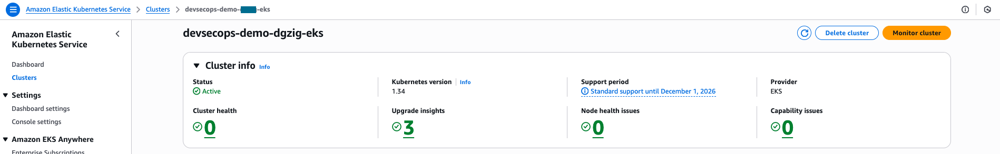

Cluster is ACTIVE with all addons running (CoreDNS, kube-proxy, vpc-cni).

**EKS Addons Status**

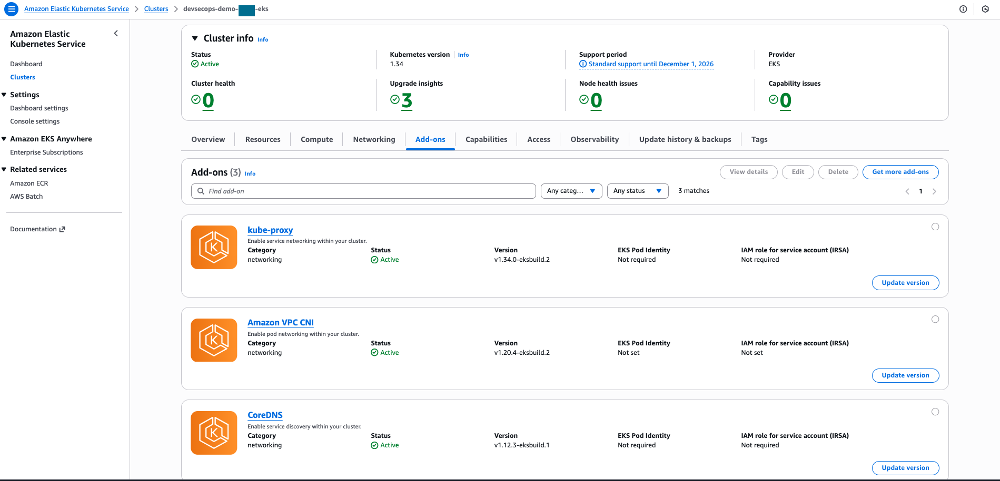

All three addons ACTIVE. CoreDNS runs on the kube-system Fargate profile.

**CodePipeline Success**

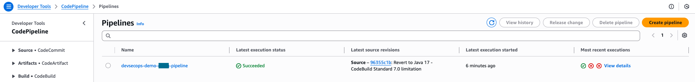

All three stages passing: Source → Build → Deploy.

**CodeBuild Execution**

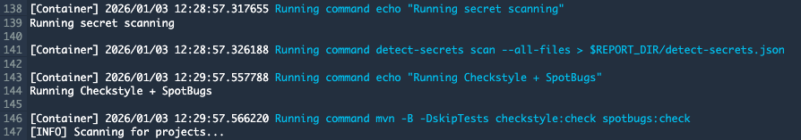
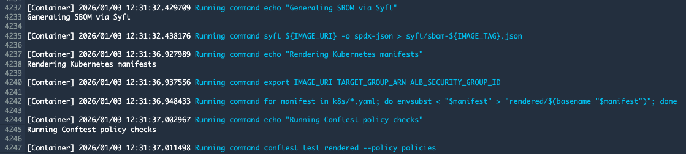

All security gates passed: secret scanning, Checkstyle, SpotBugs, SBOM generation, OPA policy validation.

### Kubernetes Deployment

**Pods Running**

```
NAME                             READY   STATUS    RESTARTS   AGE     IP           NODE
devsecops-demo-ff4c984f9-675kw   1/1     Running   0          7h42m   10.20.2.20   fargate-ip-10-20-2-20.ec2.internal
devsecops-demo-ff4c984f9-956dp   1/1     Running   0          7h44m   10.20.1.53   fargate-ip-10-20-1-53.ec2.internal
```

Two pods running across both AZs on Fargate.

**Deployment Status**

```
NAME             TYPE        CLUSTER-IP      EXTERNAL-IP   PORT(S)    AGE
devsecops-demo   ClusterIP   10.100.196.72   <none>        8080/TCP   7h44m

NAME                                              SERVICE-NAME     SERVICE-PORT   TARGET-TYPE   ARN
devsecops-demo-tgb                                devsecops-demo   8080           ip            arn:aws:elasticloadbalancing:...
```

Service and TargetGroupBinding link the pods to the ALB.

**ALB Target Health**

```
-------------------------------------------------
|             DescribeTargetHealth              |
+-------------+--------------+-------+----------+
|     AZ      |     IP       | Port  |  State   |
+-------------+--------------+-------+----------+
|  us-east-1a |  10.20.1.53  |  8080 |  healthy |
|  us-east-1b |  10.20.2.20  |  8080 |  healthy |
+-------------+--------------+-------+----------+
```

Both pods healthy in the target group.

### Application Access

**Cognito Login Page**

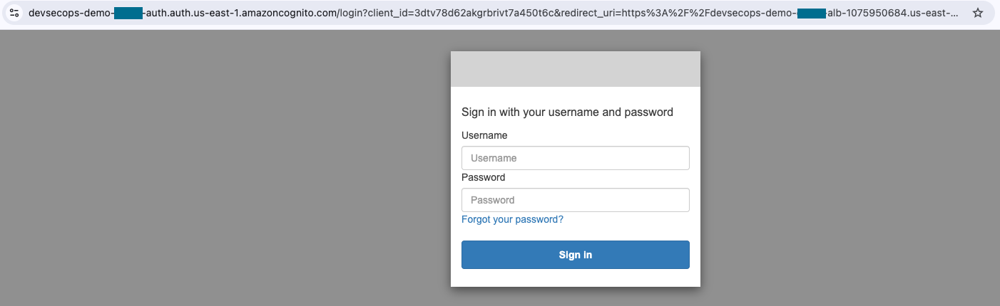

ALB redirects to Cognito before allowing access.

**Application Response**

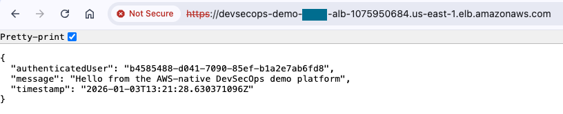

After login, the app returns JSON with metadata and timestamp.

### Monitoring & Compliance

**CloudWatch Alarms Console**

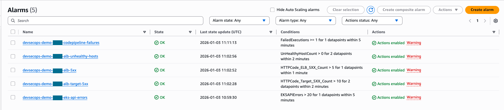

All 5 alarms in OK state: ALB 5xx errors, target 5xx errors, unhealthy hosts, pipeline failures, and EKS API errors.

**CloudWatch Alarms CLI Output**

```
AlarmName: devsecops-demo-xxxxx-alb-5xx                  | State: OK
AlarmName: devsecops-demo-xxxxx-alb-target-5xx           | State: OK
AlarmName: devsecops-demo-xxxxx-alb-unhealthy-hosts      | State: OK
AlarmName: devsecops-demo-xxxxx-codepipeline-failures    | State: OK
AlarmName: devsecops-demo-xxxxx-eks-api-errors           | State: OK
```

**S3 Compliance Artifacts**

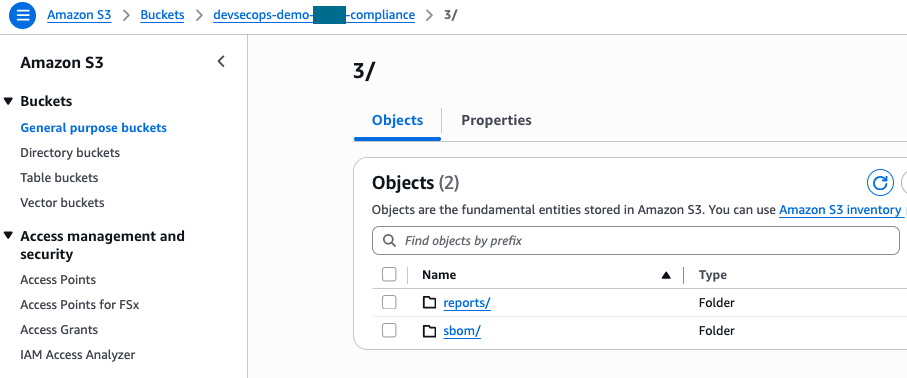
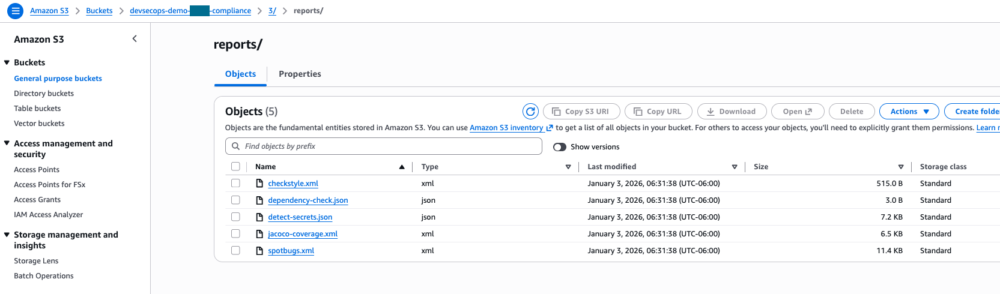

Scan reports, SBOMs, and test results auto-collected in S3 for compliance.

**Compliance Artifacts Structure**

```
reports/
├── 20241230-232737/
│   ├── checkstyle-result.xml
│   ├── sbom.json
│   ├── spotbugs.xml
│   └── test-results.xml
sbom/
├── sbom-20241230-232737.json
├── sbom-20241230-233150.json
└── sbom-latest.json
```

### WAF Protection (Optional)

**WAF Overview**

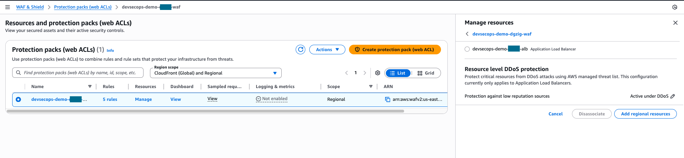

WAF Web ACL attached to the ALB.

**WAF Rules**

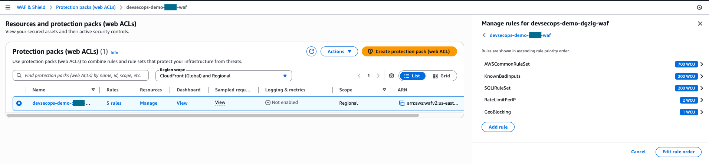

Four managed rules: Core Rule Set, Bad Inputs, SQLi protection, Rate Limiting (2000 req/5min per IP).

**WAF Blocking SQL Injection**

```
=== BLOCKED REQUESTS (SQL Injection) ===
------------------------------------------------------------------
|                       GetSampledRequests                       |
+--------+-------------------------------------------------------+
|  Action|  BLOCK                                                |
|  Rule  |  AWS#AWSManagedRulesSQLiRuleSet#SQLi_QUERYARGUMENTS   |
|  URI   |  /?test=1%20OR%201=1                                  |
+--------+-------------------------------------------------------+
```

WAF successfully blocking SQL injection attempts with 403 Forbidden response.

## Quick Validation Checklist

Use this to verify your deployment is complete and working:

**Infrastructure Setup:**

- [ ] Terraform backend created (S3 + DynamoDB)
- [ ] Infrastructure deployed (~20 min)
- [ ] EKS cluster is ACTIVE
- [ ] CoreDNS addon is ACTIVE (not DEGRADED)
- [ ] Both Fargate profiles exist (kube-system, demo)
- [ ] AWS Load Balancer Controller installed (2/2 pods ready)

**Pipeline & Deployment:**

- [ ] Code pushed to CodeCommit
- [ ] Pipeline executed successfully (~8-12 min)
- [ ] All security gates passed (secrets, SAST, SBOM, policies)
- [ ] 2 pods running in demo namespace
- [ ] TargetGroupBinding created
- [ ] ALB targets are healthy

**Application Access:**

- [ ] Cognito test user created
- [ ] ALB URL accessible (returns 302 to Cognito)
- [ ] Can login via browser
- [ ] Application responds with JSON

**Monitoring & Compliance:**

- [ ] All 5 CloudWatch alarms in OK state
- [ ] Compliance artifacts in S3 (reports/, sbom/)
- [ ] Optional: WAF enabled and blocking SQLi attempts

**Cleanup (when done):**

- [ ] terraform destroy completed (~20 min)
- [ ] All billable resources verified deleted
- [ ] Optional: State backend deleted

## Troubleshooting

### CoreDNS Shows DEGRADED Status

CoreDNS requires the kube-system Fargate profile to run. Without it, the addon stays in DEGRADED state.

```bash
# Verify Fargate profile exists
aws eks list-fargate-profiles --cluster-name $CLUSTER_NAME

# If profile exists but CoreDNS still degraded, restart it
kubectl rollout restart deployment coredns -n kube-system
kubectl wait --for=condition=available --timeout=300s deployment/coredns -n kube-system

# Verify status
aws eks describe-addon --cluster-name $CLUSTER_NAME --addon-name coredns --query 'addon.status'
```

### Pipeline Fails on First Run

If the pipeline fails during the Deploy stage, check if the AWS Load Balancer Controller is installed. The TargetGroupBinding resource won't work without it.

Install the controller following step 4 in the deployment guide above.

### TargetGroupBinding Not Creating

Give it 1-2 minutes after the Load Balancer Controller starts. If it's still missing:

```bash
# Check controller status
kubectl get pods -n kube-system -l app.kubernetes.io/name=aws-load-balancer-controller

# Check logs for errors
kubectl logs -n kube-system -l app.kubernetes.io/name=aws-load-balancer-controller --tail=50

# Verify IAM role is attached
kubectl describe serviceaccount aws-load-balancer-controller -n kube-system
```

### Self-Signed Certificate Warning

Use custom ACM certificate:

```bash
terraform apply -var acm_certificate_arn=arn:aws:acm:region:account:certificate/id
```

### Port 8080 in Use (Local Testing)

```bash
lsof -i :8080 | grep LISTEN | awk '{print $2}' | xargs kill -9
# OR
mvn spring-boot:run -Dspring-boot.run.arguments=--server.port=8081
```

### Cognito Authentication Issues

```bash
aws cognito-idp list-users --user-pool-id $(terraform output -raw cognito_user_pool_id)
```

### kubectl Authentication Error

EKS 1.30+ uses API authentication mode which requires explicit access entries. If kubectl commands fail with "the server has asked for the client to provide credentials":

```bash
# Add your IAM user to the cluster
CLUSTER_NAME=$(cd platform-terraform && terraform output -raw eks_cluster_name)
ACCOUNT_ID=$(aws sts get-caller-identity --query Account --output text)
IAM_USER=$(aws sts get-caller-identity --query 'Arn' --output text | cut -d'/' -f2)

aws eks create-access-entry --cluster-name $CLUSTER_NAME \
  --principal-arn arn:aws:iam::${ACCOUNT_ID}:user/${IAM_USER} \
  --type STANDARD --region us-east-1

aws eks associate-access-policy --cluster-name $CLUSTER_NAME \
  --principal-arn arn:aws:iam::${ACCOUNT_ID}:user/${IAM_USER} \
  --policy-arn arn:aws:eks::aws:cluster-access-policy/AmazonEKSClusterAdminPolicy \
  --access-scope type=cluster --region us-east-1
```

This replaces the legacy aws-auth ConfigMap approach.

### AWS Load Balancer Controller CrashLoopBackOff

Fargate doesn't provide EC2 instance metadata, so the controller can't auto-discover the VPC ID. Logs will show "failed to get VPC ID from instance metadata".

Fix: Install with explicit VPC ID (covered in step 4):

```bash
export VPC_ID=$(aws eks describe-cluster --name $CLUSTER_NAME --region us-east-1 --query 'cluster.resourcesVpcConfig.vpcId' --output text)
helm install aws-load-balancer-controller eks/aws-load-balancer-controller \
  -n kube-system \
  --set clusterName=$CLUSTER_NAME \
  --set serviceAccount.create=false \
  --set serviceAccount.name=aws-load-balancer-controller \
  --set vpcId=$VPC_ID
```

### CodeBuild: "yum: command not found"

CodeBuild standard:7.0 is Ubuntu-based, not Amazon Linux. Use apt-get instead of yum (already configured in buildspec.yml).

### OWASP Dependency-Check (Disabled by Default)

Dependency-Check is disabled to keep builds fast. First run takes 20+ minutes downloading NVD data.

To enable, add to platform-terraform/pipeline.tf:

```hcl
environment_variable {
  name  = "RUN_DEPENDENCY_CHECK"
  value = "true"
}
```

Then run `terraform apply`. Get an NVD API key from <https://nvd.nist.gov/developers/request-an-api-key> to speed it up.

## Cost Estimate

**Monthly costs (us-east-1, light usage):** Updated December 2025

| Service | Unit Price | Monthly Cost |
| ------- | ---------- | ------------ |
| EKS control plane | $0.10/hr | ~$73 |
| Fargate (2 pods, 0.25 vCPU, 0.5GB each) | $0.04048/vCPU/hr + $0.004445/GB/hr | ~$18 |
| NAT Gateway (2 AZs) | $0.045/hr × 2 | ~$66 |
| ALB | $0.0225/hr + LCU charges | ~$18-24 |
| CodePipeline | $1/active pipeline/mo | $1 |
| S3 + CloudWatch + Other | Various | ~$10-15 |
| **Total** | | **~$186-211/month** |

**Cost optimization tips:**

- Use single NAT for dev (saves $33/mo)
- Destroy when not in use (`terraform destroy`)
- Use Fargate Spot for non-prod (70% savings)
- Use Graviton2 (ARM) for Fargate (20% savings)

**Sources:** [AWS EKS Pricing](https://aws.amazon.com/eks/pricing/) • [Fargate Pricing](https://aws.amazon.com/fargate/pricing/) • [VPC Pricing](https://aws.amazon.com/vpc/pricing/) • [ALB Pricing](https://aws.amazon.com/elasticloadbalancing/pricing/)

## Enterprise Considerations

This demo uses a **single-account model** where one AWS account and one set of credentials provision everything (state backend, platform infrastructure, and application deployment). This is ideal for learning, testing, and portfolio demonstrations.

In **enterprise production environments**, organizations typically use a **multi-account, multi-team architecture** with separation of duties:

### Multi-Account Architecture

```
├── Shared Services Account (Account A)
│   └── Terraform State Backend (S3 + DynamoDB)
│       - Managed by: Platform/DevOps Team
│       - Access: Restricted, audit-logged
│
├── Platform Account (Account B)
│   └── EKS Cluster, VPC, CI/CD Pipeline Infrastructure
│       - Managed by: Infrastructure/Platform Team
│       - Terraform: platform-terraform/
│
└── Application Account(s) (Account C, D, E...)
    └── Application Deployments, Databases, App Resources
        - Managed by: Application Development Teams
        - Code: app-cicd/ (deployed via pipeline)
```

### Team Responsibilities

| Team | Responsibilities | Tools | Access Level |
|------|------------------|-------|--------------|
| **Platform/Infrastructure** | - EKS cluster provisioning<br>- VPC, networking, security groups<br>- CI/CD pipeline infrastructure<br>- Load balancers, IAM roles | Terraform, kubectl (admin), AWS Console | Full access to platform account<br>Cross-account roles for deployment |
| **Application Development** | - Application code development<br>- Kubernetes manifests<br>- Application configuration<br>- Feature deployment | Git, Docker, kubectl (view-only) | Limited access via CodePipeline<br>View-only access to logs/metrics<br>No direct infrastructure modification |
| **Security/Compliance** | - IAM policies and RBAC<br>- Security scanning configuration<br>- Compliance monitoring<br>- Audit log analysis | AWS Security Hub, GuardDuty, CloudWatch | Read-only access across all accounts<br>Policy enforcement capabilities |

### Key Enterprise Differences

**1. Cross-Account IAM Roles**

Platform team creates roles that allow CodeBuild in the platform account to deploy applications to separate application accounts:

```hcl
# In platform account - codebuild assumes this role to deploy to app account
resource "aws_iam_role" "cross_account_deploy" {
  name = "codebuild-deploy-to-app-account"

  assume_role_policy = jsonencode({
    Statement = [{
      Effect = "Allow"
      Principal = {
        AWS = "arn:aws:iam::PLATFORM_ACCOUNT:role/codebuild-role"
      }
      Action = "sts:AssumeRole"
    }]
  })
}
```

**2. Repository Separation**

```
├── platform-infrastructure-repo (Platform Team owns)
│   ├── terraform-backend/
│   └── platform-terraform/
│
└── application-repo (App Team owns)
    └── app-cicd/
```

Application teams only commit to their own repository. Platform changes require approval and are managed separately.

**3. Kubernetes RBAC for App Teams**

App teams get **view-only** or **namespace-scoped** access via EKS RBAC:

```yaml
# Platform team creates this RBAC binding
apiVersion: rbac.authorization.k8s.io/v1
kind: RoleBinding
metadata:
  name: app-team-view-only
  namespace: demo
subjects:
- kind: Group
  name: app-developers  # Mapped from AWS IAM via aws-auth ConfigMap
  apiGroup: rbac.authorization.k8s.io
roleRef:
  kind: ClusterRole
  name: view  # Built-in read-only role
  apiGroup: rbac.authorization.k8s.io
```

App teams can view logs and describe resources but cannot modify infrastructure or delete pods.

**4. Deployment Workflow**

**Demo (Single Account):**
```bash
# One user does everything
terraform apply  # Creates infrastructure
git push         # Deploys application
kubectl get pods # Full admin access
```

**Enterprise (Multi-Account):**
```bash
# Platform Team (one-time setup)
cd terraform-backend/ && terraform apply  # Account A
cd platform-terraform/ && terraform apply # Account B

# App Team (daily workflow)
cd app-cicd/
git commit -m "Fix bug"
git push origin main  # Triggers CodePipeline automatically
# No terraform, no kubectl admin access, no AWS console needed!

# Pipeline handles: build → scan → deploy (using cross-account roles)
```

**5. Security and Compliance**

- **Service Control Policies (SCPs)** at the AWS Organization level prevent accidental resource creation in wrong regions
- **CloudTrail** logs all API calls across all accounts to a central audit account
- **AWS Config** rules enforce compliance (e.g., "all S3 buckets must be encrypted")
- **GuardDuty** and **Security Hub** aggregate security findings across accounts

### Migration Path from Demo to Enterprise

**Phase 1: Repository Separation**
- Split into two repos: platform-infrastructure and application
- Update CI/CD to reference application repo only

**Phase 2: RBAC Implementation**
- Configure EKS aws-auth ConfigMap to map IAM roles to Kubernetes groups
- Create RoleBindings for app team (view-only or namespace-scoped)
- Test that app team can view logs but not modify infrastructure

**Phase 3: Multi-Account Setup**
- Create AWS Organization with separate accounts (Shared Services, Platform, Apps)
- Deploy terraform-backend to Shared Services account
- Deploy platform-terraform to Platform account
- Configure cross-account IAM roles for CodeBuild to deploy to App account
- Update S3 backend configuration to reference cross-account state bucket

**Phase 4: Enhanced Security**
- Enable AWS Organizations SCPs
- Configure centralized CloudTrail and AWS Config
- Set up Security Hub and GuardDuty across all accounts
- Implement approval workflows for infrastructure changes

### Comparison: Demo vs. Enterprise

| Aspect | This Demo | Enterprise Production |
|--------|-----------|----------------------|
| **AWS Accounts** | 1 account | 3-5 accounts (shared services, platform, apps) |
| **IAM Users** | 1 admin user | Multiple roles with least privilege |
| **Who runs Terraform?** | You (once for everything) | Platform team only, with approval workflow |
| **App Deployment** | You run `git push` | App team runs `git push`, pipeline does rest |
| **kubectl Access** | Full admin access | App team: view-only or namespace-scoped |
| **State Backend** | Same account as resources | Central shared services account |
| **Repository Structure** | Monorepo (all code together) | Separate repos (platform vs. app) |
| **Change Approval** | No approval needed | Pull request reviews, Terraform plan review |
| **Cost Tracking** | One account, shared costs | Per-account cost allocation tags |

### Recommended Reading

- [AWS Well-Architected Framework - Security Pillar](https://docs.aws.amazon.com/wellarchitected/latest/security-pillar/)
- [AWS Multi-Account Strategy](https://docs.aws.amazon.com/whitepapers/latest/organizing-your-aws-environment/)
- [EKS Best Practices - IAM and RBAC](https://aws.github.io/aws-eks-best-practices/security/docs/iam/)
- [Terraform Best Practices for Enterprise](https://www.terraform.io/cloud-docs/architectural-details/workspaces)

---

## Production Checklist

- [ ] Replace self-signed certs with ACM certificates
- [ ] Enable WAF with geo-blocking
- [ ] Configure SNS alerts to incident management
- [ ] Review/customize OPA policies
- [ ] Enable DR replication (`-var enable_dr_replication=true`)
- [ ] Add observability stack (Prometheus, Grafana)
- [ ] Implement network policies and pod security
- [ ] Implement multi-account architecture (see Enterprise Considerations)
- [ ] Configure RBAC for team-based access control
- [ ] Set up cross-account IAM roles for deployments
- [ ] Enable AWS Organizations with SCPs
